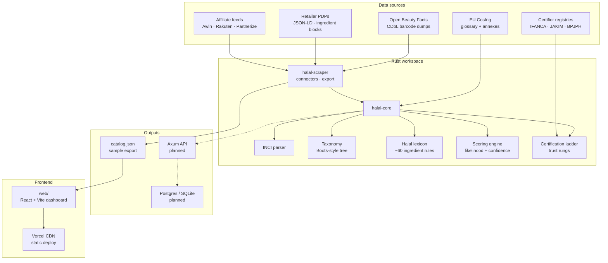
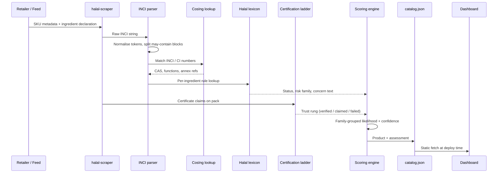
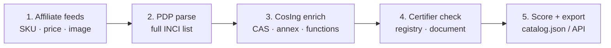
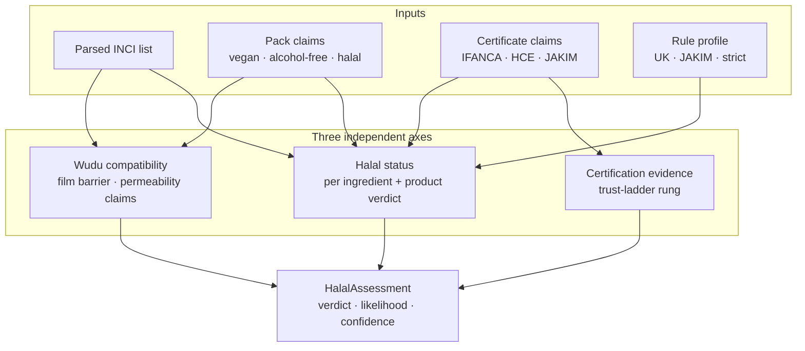
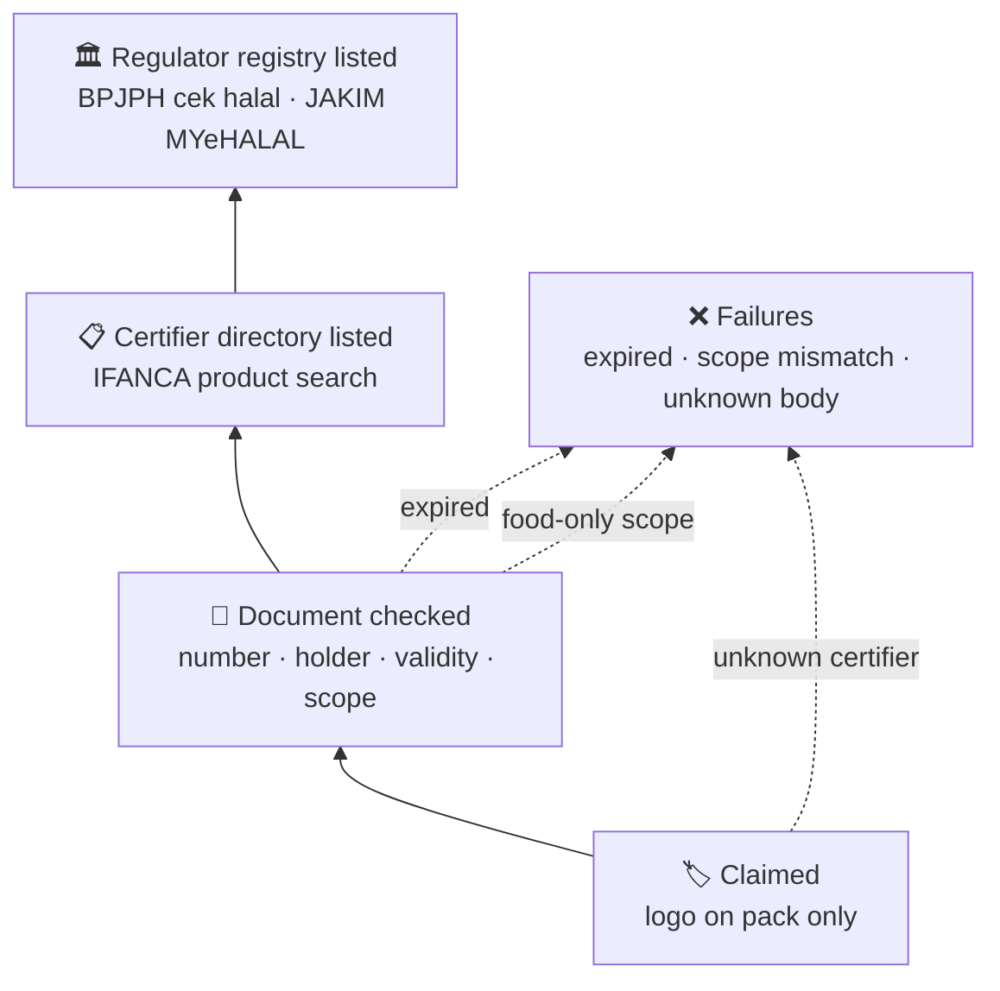
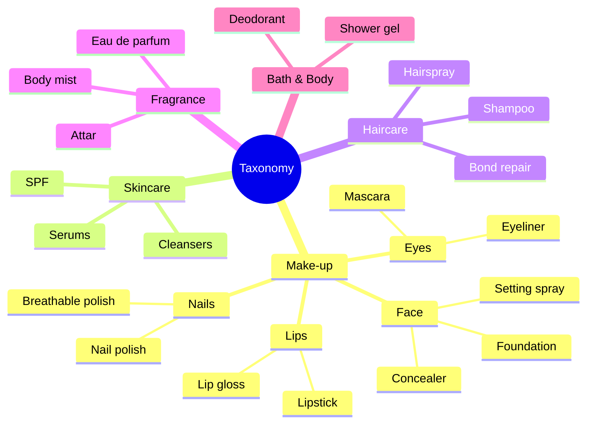
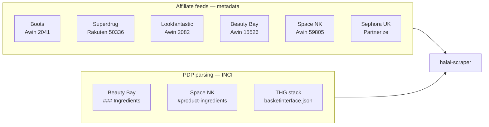
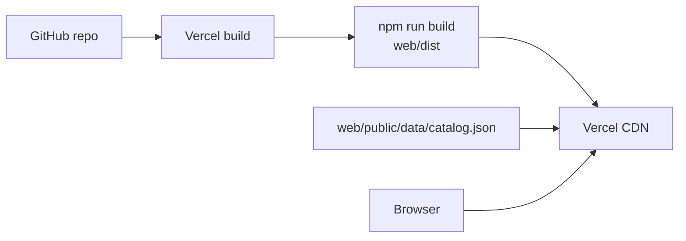
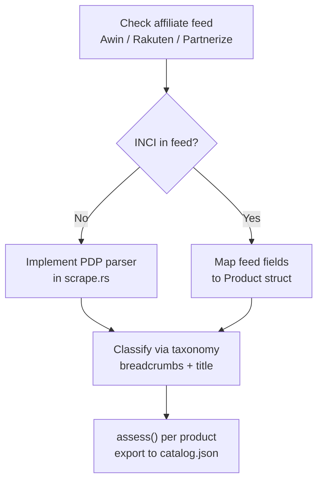
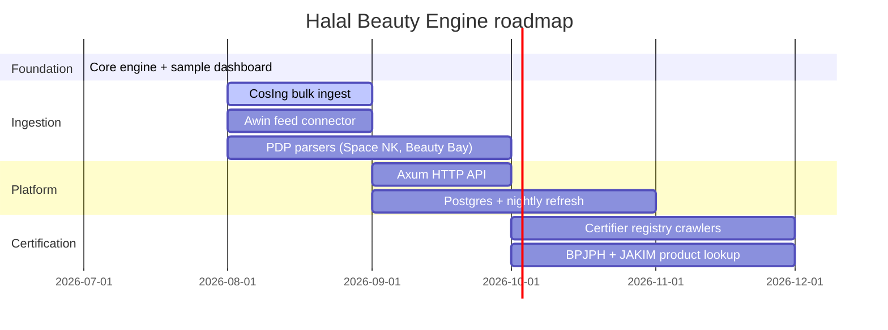

# Halal Beauty Engine

A Rust-backed halal beauty product engine for UK retailers — Boots, Superdrug, Lookfantastic, Space NK, Beauty Bay, Cult Beauty, Holland & Barrett, and more. It ingests product catalogues, enriches ingredient lists with the EU **CosIng** database, scores **halal likelihood**, and verifies **official halal certification** through a trust-ladder model (IFANCA, HCE, JAKIM, BPJPH, HMC, and others).

This repository ships:

- **`halal-core`** — domain engine (INCI parsing, taxonomy, lexicon, scoring, certification ladder)
- **`halal-scraper`** — sample catalogue export + optional live PDP probe
- **`web/`** — React/Vite sample dashboard, deployable to **Vercel**

> **Status:** Sample dashboard with bundled data. Live retailer ingestion and CosIng bulk ingest are documented as the next pipeline stages.

---

## Table of contents

- [Architecture](#architecture)
- [Data pipeline](#data-pipeline)
- [Halal assessment model](#halal-assessment-model)
- [Certification trust ladder](#certification-trust-ladder)
- [Product taxonomy](#product-taxonomy)
- [UK retailer strategy](#uk-retailer-strategy)
- [Dashboard](#dashboard)
- [Quick start](#quick-start)
- [Deploy to Vercel](#deploy-to-vercel)
- [MCP servers & APIs](#mcp-servers--apis)
- [Project layout](#project-layout)
- [Development](#development)
- [Legal & compliance](#legal--compliance)
- [Roadmap](#roadmap)
- [Licence](#licence)

---

## Architecture



### Crate responsibilities

| Crate | Role |
|-------|------|
| `halal-core` | Pure domain logic — no I/O. Parses INCI, classifies products, matches lexicon rules, scores halal likelihood, verifies certificates. |
| `halal-scraper` | I/O boundary — exports bundled sample data; optional live PDP fetch behind `--features live`. |
| `web` | Static dashboard consuming `catalog.json`. Filters, product cards, ingredient drawer. |

---

## Data pipeline

How a product moves from a retailer shelf to a scored catalogue entry:



### Ingestion priority (recommended)



| Stage | Source | Provides | Does not provide |
|-------|--------|----------|------------------|
| Affiliate feed | Awin, Rakuten, Partnerize | Name, brand, price, image URL, EAN, category | Full INCI lists |
| PDP parse | Beauty Bay, Space NK, etc. | Ingredient declaration, JSON-LD | Licensed image redistribution |
| Open Beauty Facts | `world.openbeautyfacts.org` | Crowdsourced INCI by barcode | Complete UK coverage |
| CosIng | EU Commission | INCI glossary, Annex II–VI cross-refs | Halal status |
| Certifier registry | IFANCA, BPJPH, JAKIM | Verified certificate scope | Unified global API |

---

## Halal assessment model

The engine separates three independent axes that consumer apps often conflate:



### Likelihood scoring

Likelihood is the estimated probability that every **source-ambiguous** ingredient took a permissible route. It is computed **multiplicatively over risk families**, not per ingredient:

```
likelihood = Π over families ( 1 − max_risk_in_family )
```

A moisturiser listing glycerin, cetearyl alcohol, glyceryl stearate, and stearic acid reflects **one** palm-vs-tallow sourcing decision, not four independent gambles.

| Verdict | Meaning |
|---------|---------|
| `certified-halal` | Certificate passed trust-ladder checks |
| `likely-halal` | No prohibited ingredients; low residual doubt |
| `needs-verification` | Mashbooh ingredients; source evidence would settle it |
| `likely-not-permissible` | High animal-route probability without resolution |
| `not-permissible` | Categorical haram ingredient (e.g. carmine) |
| `unknown` | No ingredient declaration on file |

**Confidence** is a separate percentage driven by data coverage (recognised INCI tokens, CosIng matches, certificate evidence) — not by how good the news is.

### Rule profiles

| Profile ID | Position |
|------------|----------|
| `uk-general` | Default — topical ethanol doubtful, not prohibited; insect colourants excluded |
| `jakim-ms2634` | Malaysian MS 2634 — documented halal sourcing for animal material |
| `bpjph-mui` | Indonesian regulator — ethanol OK if not from khamr industry |
| `strict` | Any ethanol or undocumented animal route is disqualifying |
| `lenient-istihalah` | Accepts transformation argument for disputed derivatives |

---

## Certification trust ladder

Halal logos on packaging are not treated as a boolean. Each claim climbs (or falls through) an ordered ladder:



### Bodies in the register

| Body | ID | Cosmetics scope | Public directory |
|------|----|-----------------|------------------|
| IFANCA | `ifanca` | Yes | [halal-certified-products](https://ifanca.org/halal-certified-products/) |
| HCE (UK) | `hce` | Yes | Certificate-by-certificate |
| HFA (UK) | `hfa` | Yes | Internal only |
| HMC (UK) | `hmc` | Yes | [outlets](https://halalhmc.org/outlets/) (premises) |
| BPJPH (Indonesia) | `bpjph` | Yes | [cek halal](https://info.halal.go.id/cari/) |
| JAKIM (Malaysia) | `jakim` | Yes | [MYeHALAL](https://myehalal.halal.gov.my/) |
| AFIC (Australia) | `afic` | Not confirmed | Site certifications only |
| MOIAT (UAE) | `moiat` | Yes (GSO 2055-4) | [registered HCBs](https://moiat.gov.ae/en/programs/halal/registered-halal-certification-bodies) |

> HMC explicitly does **not** verify water-permeability claims. A halal certificate and wudu-compatibility are separate questions.

---

## Product taxonomy

Categories follow the three-level structure used by UK high-street beauty retailers (department → category → product type), with attributes that affect scoring:



| Attribute | Affects |
|-----------|---------|
| `application` | Ethanol tolerance — rinse-off vs leave-on vs evaporative (perfume) |
| `film_risk` | Wudu verdict — nail polish and waterproof mascara form barriers |

Classification uses retailer breadcrumbs first, then title keyword fallback. See `crates/halal-core/data/taxonomy.json`.

---

## UK retailer strategy



| Retailer | Affiliate feed | INCI on PDP | robots.txt PDP crawl |
|----------|---------------|---------------|----------------------|
| Boots | Awin 2041 | Uncertain (WAF) | Likely permitted |
| Superdrug | Rakuten 50336 | Uncertain (WAF) | Likely permitted |
| Lookfantastic | Awin 2082 | Via THG stack | Likely permitted |
| Cult Beauty | Awin 29063 | Via THG stack | Likely permitted |
| Space NK | Awin 59805 | Verified | Likely permitted |
| Beauty Bay | Awin 15526 | Verified | Likely permitted |
| Sephora UK | Partnerize | Uncertain | `/p/` permitted |
| Holland & Barrett | Awin (UK TBC) | SPA / variable | Likely permitted |

**Important:** THG (Lookfantastic, Cult Beauty) and Beauty Bay affiliate terms **prohibit scraping** — use their affiliate feeds for metadata and parse INCI only where contractually permitted.

---

## Dashboard

The sample UI uses the project colour palette:

| Token | Hex | Use |
|-------|-----|-----|
| Cotton rose | `#efc7c2` | Accents, gradients |
| Powder petal | `#ffe5d4` | Page background |
| Ash grey | `#bfd3c1` | Secondary surfaces |
| Muted teal | `#68a691` | Links, positive badges |
| Mauve shadow | `#694f5d` | Body text |

```css
:root {
  --cotton-rose: #efc7c2;
  --powder-petal: #ffe5d4;
  --ash-grey: #bfd3c1;
  --muted-teal: #68a691;
  --mauve-shadow: #694f5d;
}
```

### Dashboard features

- Product grid with image, retailer, price, halal verdict badge
- Filters: search, retailer, department, verdict
- Product drawer: full INCI, per-ingredient status, CosIng fields, likelihood/confidence meters, certification rung, wudu notes, key drivers

### Sample products (11)

Includes certified foundation (HCE), carmine lipstick, alcohol-based perfume, alcohol-free attar (IFANCA), breathable nail polish, vegan shampoo with source attestation, and a product with no INCI (unknown verdict).

---

## Quick start

### Prerequisites

- Rust 1.83+ (`cargo`)
- Node.js 20+ (`npm`)

### 1. Export sample catalogue

```bash
cargo run -p halal-scraper -- export-sample
# → web/public/data/catalog.json
```

Or use the helper script:

```bash
./scripts/export-catalog.sh
```

### 2. Run the dashboard locally

```bash
cd web
npm install
npm run dev
```

Open [http://localhost:5173](http://localhost:5173)

### 3. Run tests

```bash
cargo test -p halal-core    # 62 unit tests
cd web && npm run build     # TypeScript + Vite production build
```

---

## Deploy to Vercel



1. Import this repository at [vercel.com/new](https://vercel.com/new)
2. Root `vercel.json` is preconfigured:

   | Setting | Value |
   |---------|-------|
   | Install | `cd web && npm install` |
   | Build | `cd web && npm run build` |
   | Output | `web/dist` |

3. Deploy — the committed `catalog.json` powers the sample UI

**Refresh data before a deploy:**

```bash
cargo run -p halal-scraper -- export-sample
git add web/public/data/catalog.json
git commit -m "Refresh sample catalogue"
git push
```

---

## Live scraping (optional)

PDP probe for connector development. Requires `--features live` (needs Rust 1.85+ for the full `reqwest` dependency tree on some hosts):

```bash
cargo run -p halal-scraper --features live -- probe \
  --retailer beautybay \
  --sku bb-3310 \
  "https://www.beautybay.com/p/beauty-bay/brighten-hydrate-serum/"
```

The probe fetches HTML, extracts JSON-LD `Product` blocks, and parses ingredient sections (Beauty Bay `### Ingredients`, Space NK `#product-ingredients`, accordion patterns).

---

## MCP servers & APIs

Recommended MCP servers for building out the full pipeline:

### Ingestion & research

| MCP / API | URL | Role |
|-----------|-----|------|
| Firecrawl MCP | [github.com/mendableai/firecrawl-mcp-server](https://github.com/mendableai/firecrawl-mcp-server) | Structured crawl/extract |
| Playwright MCP | [github.com/microsoft/playwright-mcp](https://github.com/microsoft/playwright-mcp) | JS-rendered PDP automation |
| MCP Fetch | [github.com/modelcontextprotocol/servers](https://github.com/modelcontextprotocol/servers/tree/main/src/fetch) | robots.txt, single-page fetch |
| Brave Search MCP | [github.com/brave/brave-search-mcp-server](https://github.com/brave/brave-search-mcp-server) | Certifier / standard research |
| Exa MCP | [github.com/exa-labs/exa-mcp-server](https://github.com/exa-labs/exa-mcp-server) | Ingredient/supplier discovery |

### External data APIs

| API | Endpoint | Licence | Provides |
|-----|----------|---------|----------|
| EU CosIng | [ec.europa.eu/growth/tools-databases/cosing](https://ec.europa.eu/growth/tools-databases/cosing/) | CC BY 4.0 | INCI glossary, annexes |
| Open Beauty Facts | `world.openbeautyfacts.org/api/v2/product/{barcode}` | ODbL | Crowdsourced INCI |
| PubChem PUG-REST | `pubchem.ncbi.nlm.nih.gov/rest/pug/` | Public domain | CAS, synonyms |
| Awin Publisher API | `api.awin.com/publishers/{id}/awinfeeds/download/…` | Affiliate T&Cs | UK retailer feeds |
| Rakuten Product Catalog | `aftp.linksynergy.com` (SFTP) | Affiliate T&Cs | Superdrug feed |
| Partnerize Feeds | `api.partnerize.com/campaign/{id}/feed` | Affiliate T&Cs | Sephora UK |
| IFANCA directory | [ifanca.org/halal-certified-products](https://ifanca.org/halal-certified-products/) | Public web | Certified products |
| BPJPH cek halal | [info.halal.go.id/cari](https://info.halal.go.id/cari/) | Public web | Indonesian registry |
| JAKIM MYeHALAL | [myehalal.halal.gov.my](https://myehalal.halal.gov.my/portal-halal/v1/index.php) | Public web | Malaysian verification |

### Storage, search & ops

| MCP | URL | Role |
|-----|-----|------|
| DBHub | [github.com/bytebase/dbhub](https://github.com/bytebase/dbhub) | SQL gateway (Postgres, SQLite) |
| Neon MCP | [github.com/neondatabase/mcp-server-neon](https://github.com/neondatabase/mcp-server-neon) | Serverless Postgres |
| Qdrant MCP | [github.com/qdrant/mcp-server-qdrant](https://github.com/qdrant/mcp-server-qdrant) | INCI similarity / RAG |
| Sentry MCP | [docs.sentry.io/product/sentry-mcp](https://docs.sentry.io/product/sentry-mcp/) | Scraper error tracking |
| Vercel MCP | [github.com/vercel/mcp-handler](https://github.com/vercel/mcp-handler) | Dashboard deploys |
| GitHub MCP | [github.com/github/github-mcp-server](https://github.com/github/github-mcp-server) | CI, issue automation |

---

## Project layout

```
beauty-data-engine/
├── Cargo.toml                  # Rust workspace
├── vercel.json                 # Vercel static deploy config
├── scripts/
│   └── export-catalog.sh       # Regenerate catalog.json
├── crates/
│   ├── halal-core/
│   │   ├── data/
│   │   │   ├── taxonomy.json   # Boots-style 3-level tree
│   │   │   ├── lexicon.json      # ~60 halal ingredient rules
│   │   │   └── certifiers.json   # Certification body register
│   │   └── src/
│   │       ├── inci.rs           # INCI declaration parser
│   │       ├── taxonomy.rs       # Product classification
│   │       ├── lexicon.rs        # Ingredient rule matching
│   │       ├── certification.rs  # Trust-ladder verification
│   │       ├── scoring.rs        # Halal assessment engine
│   │       └── product.rs        # Product record model
│   └── halal-scraper/
│       └── src/
│           ├── sample.rs         # Bundled UK retailer samples
│           ├── scrape.rs         # PDP parser (feature: live)
│           └── main.rs           # CLI: export-sample, probe
└── web/
    ├── public/data/catalog.json  # Generated catalogue (committed)
    └── src/
        ├── App.tsx               # Dashboard
        ├── lib/format.ts         # Verdict labels, price formatting
        └── styles/global.css     # Palette + layout
```

---

## Development

### Regenerate catalogue after engine changes

```bash
cargo test -p halal-core          # verify engine
cargo run -p halal-scraper -- export-sample
cd web && npm run dev             # preview changes
```

### Adding a retailer connector



1. Add retailer to `sample.rs` (or a future `connectors/` module)
2. Map breadcrumbs to `taxonomy.json` `breadcrumb_map`
3. Run `export-sample` and verify in the dashboard

### Adding a lexicon rule

Edit `crates/halal-core/data/lexicon.json`:

```json
{
  "id": "my-ingredient",
  "label": "Human-readable name",
  "matches": { "inci": ["INCI NAME"], "ci": ["75470"] },
  "origin": "ambiguous",
  "status": "mashbooh",
  "ambiguity": "source",
  "animal_route_likelihood": 0.3,
  "risk_family": "fatty-chain",
  "concern": "Why this matters to a shopper.",
  "resolvable_by": ["vegan-certification", "plant-source-declaration"]
}
```

---

## Legal & compliance

| Topic | Guidance |
|-------|----------|
| **Database right** | Systematic extraction of substantial retailer catalogues may infringe UK/EU sui generis database rights. Prefer affiliate feeds. |
| **Scraping T&Cs** | THG and Beauty Bay affiliate terms explicitly prohibit scraping. |
| **Images** | Retailer product photography is copyright; affiliate feeds grant promotional-use licences only. |
| **INCI / facts** | Ingredient lists and prices are generally not copyrightable, but the compilation may be protected. |
| **CosIng** | EC content under CC BY 4.0 — attribution required. |
| **Open Beauty Facts** | ODbL — share-alike on derivative databases. |
| **Halal claims** | This engine provides likelihood assessments, not fatwas. Certified products require trust-ladder verification. |

---

## Roadmap



| Phase | Deliverable |
|-------|-------------|
| **Now** | Sample dashboard on Vercel, Rust core, bundled catalogue |
| **Next** | CosIng XLS ingest, Awin feed for Boots/Superdrug metadata |
| **Then** | Axum API, Postgres store, scheduled scrape jobs |
| **Later** | Certifier registry automation, barcode scan endpoint, user rule profiles |

---

## Licence

AGPL-3.0-or-later
