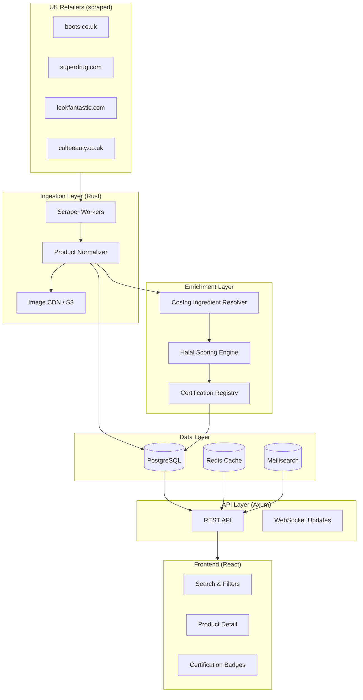

# Halal Beauty Data Engine — Architecture

A UK-focused beauty product intelligence platform that scrapes retailer catalogues, enriches ingredients via the EU CosIng database, scores halal compliance, and surfaces official certification status.

## System Overview



## Core Data Flow

1. **Scrape** — Scheduled workers crawl UK retailer category pages (Boots taxonomy as canonical).
2. **Normalize** — Map retailer SKUs to a unified product schema; deduplicate by EAN/barcode where available.
3. **Enrich** — Parse INCI ingredient lists; resolve each INCI name against CosIng.
4. **Score** — Run halal rules engine (haram / mashbooh / halal) with configurable madhab/standard profiles.
5. **Certify** — Cross-reference brand/product against IFANCA, AFIC, LPPOM MUI, and HCE registries.
6. **Serve** — Expose filtered catalogue via REST API and real-time scrape progress via WebSocket.

## Product Record Schema

Each product carries:

| Field | Source | Description |
|-------|--------|-------------|
| `id` | Internal | UUID |
| `retailer` | Scraper | `boots`, `superdrug`, etc. |
| `retailer_sku` | Scraper | Retailer product code |
| `name` | Scraper | Product title |
| `brand` | Scraper | Brand name |
| `image_url` | Scraper | Primary product image (cached locally) |
| `category_path` | Taxonomy | Boots-aligned breadcrumb path |
| `product_type` | Taxonomy | `makeup`, `skincare`, `fragrance`, `haircare`, etc. |
| `sub_type` | Taxonomy | e.g. `lipstick`, `eau_de_parfum`, `shampoo` |
| `ingredients_raw` | Scraper | Raw INCI string from PDP |
| `ingredients` | CosIng | Resolved ingredient objects |
| `halal_score` | Engine | 0–100 likelihood score |
| `halal_status` | Engine | `halal`, `likely_halal`, `mashbooh`, `likely_haram`, `haram` |
| `halal_flags` | Engine | List of flagged ingredients with reasons |
| `certifications` | Cert Registry | Official cert records (if any) |
| `price_gbp` | Scraper | Current price |
| `url` | Scraper | Source product page |

## Halal Scoring Model

```
halal_score = base_score - Σ(penalty_per_flag) + cert_bonus

base_score = 100 (no flags)
cert_bonus = +20 if active official certification matches product/brand
```

Status thresholds:

| Score | Status | Meaning |
|-------|--------|---------|
| 90–100 + cert | `halal` | Certified or all-clear ingredients |
| 75–89 | `likely_halal` | No haram flags; minor mashbooh |
| 50–74 | `mashbooh` | Ambiguous ingredients (unsourced glycerin, etc.) |
| 25–49 | `likely_haram` | One or more probable haram ingredients |
| 0–24 | `haram` | Definite haram (carmine, porcine collagen, etc.) |

## Certification Verification (Added Module)

Official halal makeup/perfume/haircare verification relies on recognized certification bodies:

| Body | Region | Cosmetics Scope | Verification Method |
|------|--------|-----------------|---------------------|
| **IFANCA** | US/Global | Food, cosmetics, pharma | Scrape `ifanca.org` product database |
| **AFIC** | Australia | Food, cosmetics | Scrape `afic.org.au` certified products |
| **LPPOM MUI** | Indonesia | Food, drugs, cosmetics | BPJPH/SiHalal API + halalmui.org |
| **HCE** | EU (Halal Certification Europe) | Cosmetics, food | Scrape `halalcertification.eu` registry |

The `certification_registry` module maintains:

- Brand-level certifications (covers product line)
- Product-level certifications (specific SKU/name match)
- Certificate metadata: number, issuer, issue/expiry dates, status
- Confidence score for fuzzy name matching

## Retailer Scraping Strategy

### Boots.co.uk
- Category tree via `ProductListingViewRedesign` POST endpoint
- Pagination via `productBeginIndex` parameter
- PDP scrape for INCI ingredients, images, EAN

### Superdrug.com
- Category pages with JSON-LD product data where available
- Fallback HTML parsing for ingredient lists

### Additional UK Retailers
- Look Fantastic, Cult Beauty, Space NK — similar scrape patterns
- All products mapped to Boots-aligned taxonomy

## Tech Stack

| Layer | Technology |
|-------|------------|
| Backend | Rust (Axum, Tokio, SQLx, Reqwest, Scraper) |
| Database | PostgreSQL 16 |
| Cache | Redis |
| Search | Meilisearch |
| Queue | Redis + custom job runner (or NATS later) |
| Frontend | React 19 + TypeScript + Vite |
| Styling | CSS custom properties (design tokens) |
| Container | Docker Compose |

## Model Assignment (Development Workflow)

| Task | Recommended Model |
|------|-------------------|
| Quick fixes, CSS tweaks, small refactors | Composer 2.5 |
| Web scraping research, retailer HTML analysis, API discovery | Sonnet 5 + Composer 2.5 |
| Core engine build, halal rules, architecture | Opus 5 |

## Directory Layout

```
beauty-data-engine/
├── backend/                 # Rust API + workers
│   └── src/
│       ├── api/             # HTTP handlers
│       ├── cosing/          # CosIng client + cache
│       ├── halal/           # Rules engine + scoring
│       ├── certification/   # IFANCA, AFIC, MUI, HCE
│       ├── models/          # Domain types
│       ├── scrapers/        # Per-retailer scrapers
│       └── taxonomy/        # Boots-aligned category tree
├── frontend/                # React SPA
│   └── src/
│       ├── components/
│       ├── pages/
│       └── styles/
├── docs/
├── docker-compose.yml
└── README.md
```
